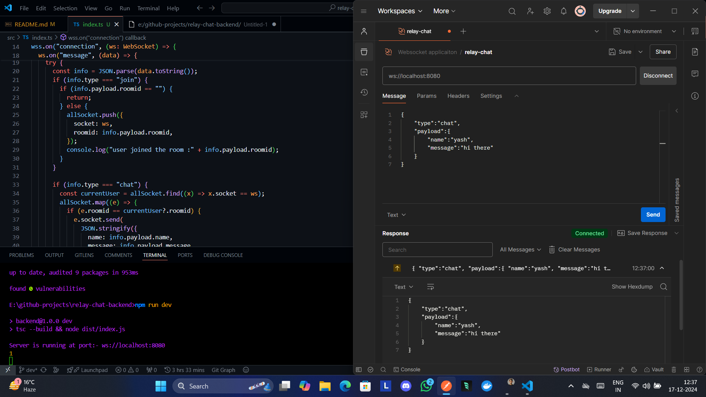

# WebSocket Chat Application

A simple WebSocket-based chat application where users can create, join, and chat in rooms.

## 📦 Prerequisites


|  |  |  |
|-----------------|---------|------|

## ✨ Features  
- Create a room ID with a unique 6-character code. 🔑
- Join existing chat rooms. 🚪
- List active rooms with the number of users. 📋
- Real-time chat functionality (message polling). 💬

## 📁 Project Structure

```
.
├── .gitignore
├── dist/
│   └── index.js
├── node_modules/
├── package-lock.json
├── package.json
├── README.md
├── src/
│   └── index.ts
├── tsconfig.json
└── tsconfig.tsbuildinfo
```

## 🛠️ Setup Instructions

1. Clone the repository:
   ```bash
   git clone https://github.com/yashksaini-coder/relay-chat-backend
   cd relay-chat-backend
   ```

2. Install dependencies:
   ```bash
   npm install
   ```

3. Start the server:
   ```bash
   npm run dev
   ```

### 🧪 Testing:

To test the updated functionality, you can use a Postman and use the Websocket server instance. These are the messages to check the functionality:


